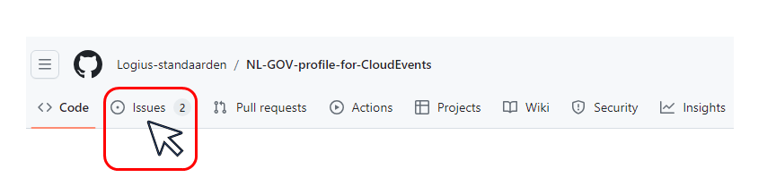
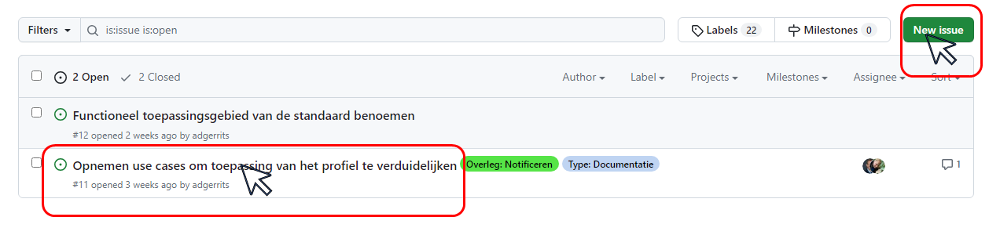

# Openbare Consultaties van Logius afdeling Standaarden

## Lopende Consultaties

|Label|Locatie|Omschrijving|Consultatie loopt tot|
|---|---|---|---|
(Op dit moment lopen er geen openbare consultaties )

<!-- (Op dit moment lopen er geen openbare consultaties  -->

## Op- en Aanmerkingen

U kunt op- en aanmerkingen aanbrengen via de Issue pagina van de bijbehorende repository. Gebruik het aangegeven `Label` bij uw commentaar. Voor instructie zie [onderaan deze pagina](https://github.com/Logius-standaarden/Openbare-Consultaties#issues-en-pull-requests-opmerkingen-maken-of-tekstvoorstellen-indienen).

U kunt natuurlijk ook op- en aanmerkingen aanbrengen op de issues pagina van de respositories van de specifieke dossiers.
### Commentaar per email

Het is ook mogelijk uw commentaar te sturen per email naar api[@]logius.nl.

 
 

## Afgeronde Consultaties

|Onderwerp|Locatie|Omschrijving|Consultatie geëindigd op|
|---|---|---|---|
| Digikoppeling Standaard 2024 | [Consultatie Digikoppeling Standaard 2024 ](./20240919_Digikoppeling) | Wijzigingen Release 2024 - Onderdelen Architectuur, Beveiligingsvoorschriften, REST-API Koppelvlakstandaard, Identificatie & Authenticatie| 4/12/2024  |
| Digikoppeling REST API profiel | [Federatieve Service Connectiviteit (FSC) opnemen in het Digikoppeling REST API profiel](https://github.com/Logius-standaarden/Openbare-Consultaties/tree/master/Digikoppeling%20REST-API%20profiel%20-%20Opnemen%20FSC%20Standaard) | Federatieve Service Connectiviteit (FSC) opnemen in het Digikoppeling REST API profiel. De FSC standaard beschrijft hoe op een uniforme wijze koppelingen te maken en te beheren zijn. | 3/8/2024  |
|NLGOV profiel CloudEvents | [ NL-GOV-profile-for-CloudEvents](https://github.com/Logius-standaarden/NL-GOV-profile-for-CloudEvents) | Het NL GOV profile for CloudEvents is een specificatie voor het gestandaardiseerd beschrijven en uitwisselen van plaatsgevonden gebeurtenissen tussen applicaties. | 20-4-2024 |
|Digikoppeling|[Digikoppeling REST-API Koppelvlakstandaard](https://logius-standaarden.github.io/Publicatie-Preview/Digikoppeling-Koppelvlakstandaard-REST-API/Toevoegen-API-58/)| Toevoegen API-58 regel aan het REST-API profiel.   Zie [RFC-Toevoegen API-58 No sensitive information in URIs ](https://github.com/Logius-standaarden/Digikoppeling-Koppelvlakstandaard-REST-API/issues/15)| 19-9-2022|
|Toevoeging Digikoppeling REST API profiel|[Digikoppeling REST API profiel](https://github.com/centrumvoorstandaarden/DigikoppelingRestfulApiProfiel)| Opname van een REST API profiel (op basis van de API Design Rules) in Digikoppeling |3 maart 2021|
|Wijziging Digikoppeling Architectuur|[Digikoppeling Architectuur](https://github.com/centrumvoorstandaarden/Architectuur2.0-metRestfulAPI)| De aanleiding van de vernieuwing is tweeledig: in 2019 is een RFC ingediend over de relatie van de Digikoppeling profielen met bevragen en melden. Daarnaast is een Rest API profiel uitgewerkt voor de Digikoppeling Standaard op basis van de API Design Rules (zie hierboven)|3 maart 2021|
|Wijziging Digikoppeling WUS - 2020|[Digikoppeling Koppelvlakstandaard WUS](https://github.com/Logius-standaarden/Openbare-Consultaties/tree/master/20201007_Digikoppeling_WUS-gereed)|RFC 2020-2 wsa-to, RFC 2020-3 mtom| 18 november 2020|
|Wijziging OIN regels - 2020| [OIN Stelsel](https://github.com/Logius-standaarden/Openbare-Consultaties/tree/master/OIN%20Stelsel-consultatie-gereed) |Wijzigingen in het gebruik en uitgifte van SubOINS| 4 november 2020|

 
 
 

## Issues en Pull Requests: Opmerkingen maken of tekstvoorstellen indienen

Om opmerkingen (*Issues* in Github) te maken in een dossier (repository) heeft u een Github Account nodig. U kunt dit account gratis aanmaken.

Met uw account kunt u Issues of Pull Request maken in een repository of reageren op ingediende issues.

|Onderwerp|Link|  
|---|---|
|Aanmaken Github Account| [Create account](https://github.com/signup?ref_cta=Sign+up&ref_loc=header+logged+out&ref_page=%2F&source=header-home)|
|Aanmaken Issue| [Creating an issue](https://docs.github.com/en/free-pro-team@latest/github/managing-your-work-on-github/creating-an-issue)|
|Aanmaken Pull request| [Creating an issue or pull request](https://docs.github.com/en/free-pro-team@latest/desktop/contributing-and-collaborating-using-github-desktop/creating-an-issue-or-pull-request)|

 
 

### Schermvoorbeelden

**De Issues pagina van een Repository**

figuur 1. Klik op de Issues tab van een repository

 
 

**Issues aanmaken of reageren op bestaande issues**

figuur 2. Klik in een Issues pagina op *New issue* of bekijk een bestaande issue en discussieer mee

